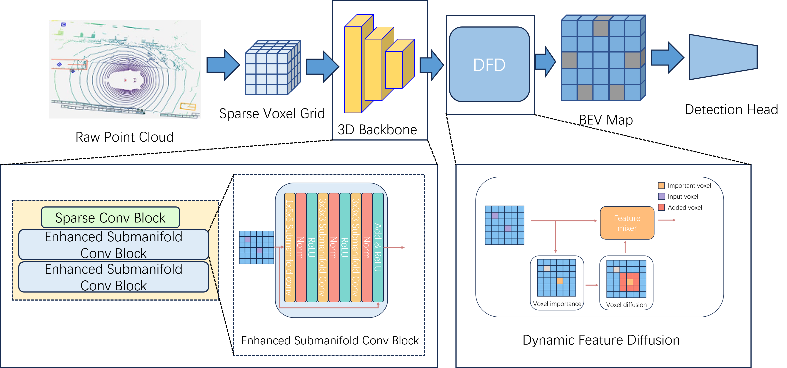

# EDFDNet: Enhanced Submanifold Convolutional Block and Dynamic Feature Diffusion for Fully Sparse 3D Object Detection

This is a pytorch implementation of 《EDFDNet: Enhanced Submanifold Convolutional Block and Dynamic Feature Diffusion for Fully Sparse 3D Object Detection》. 

Detail information will be released after publication.


## Abstract

The VoxelNext architecture in LiDAR-based fully sparse object detection has garnered significant attention due to its efficient processing. This paper aims to optimize VoxelNext, focusing on addressing two critical issues: firstly, the limitation of submanifold sparse convolution in feature interaction, and secondly, the reduced detection performance due to sparse or missing features in object center areas. In this paper, we introduce the Enhanced Submanifold Sparse Convolution Block (ESCB), leveraging enlarged kernels to bolster feature interaction capabilities, enabling non-interactive features to participate in meaningful interactions, thereby enhancing feature extraction and representation. Additionally, we propose the Dynamic Feature Diffusion (DFD) module, which diffuses features dynamically to alleviate the problem of missing features in the central region. Extensive experiments on two datasets(KITTI and Waymo) have demonstrated the outstanding performance of our method, which significantly improves detection accuracy. 

## Performance
TABLE I: Results on the KITTI Validation Set. VoxelNext* represents the reproduction result of the official code.
|                       | Car Easy   | Car Mod.   | Car Hard  | Pedestrian Easy     | Pedestrian Mod.     | Pedestrian Hard     | Cyclist Easy    | Cyclist Mod.    | Cyclist Hard    | mAp   |
|-----------------------|------------|------------|-----------|---------------------|---------------------|---------------------|----------------|----------------|----------------|-------|
| VoxelNet     | 81.9       | 65.4       | 62.8      | 39.4                | 33.6                | 31.5                | 61.2           | 48.3           | 44.3           | 52.1  |
| Second        | 87.4       | 76.4       | 69.1      | 51.0                | 42.5                | 37.2                | 70.5           | 53.8           | 46.9           | 59.4  |
| PointPillar  | 83.6       | 75.5       | 68.6      | 60.3                | 57.7                | 52.7                | 79.5           | 60.9           | 56.8           | 66.2  |
| SA-SSD      | **89.7**   | **79.4**   | **78.3**  | 55.8                | 48.0                | 41.9                | 82.8           | 63.4           | 61.6           | 66.7  |
| TANet       | 87.5       | 76.6       | 73.8      | **67.3**            | **60.7**            | **54.4**            | **84.5**       | 61.6           | 57.4           | **69.3** |
| VoxelNext*   | 86.7       | 77.5       | 73.4      | 57.3                | 52.7                | 47.3                | 80.9           | 65.2           | 61.1           | 66.9  |
| EDFDNet(ours)         | 87.2       | 78.0       | 75.2      | 61.7                | 55.8                | 50.2                | 83.0           | **67.1**       | **62.5**       | 69.0  |

*Note: VoxelNext\* represents the reproduction result of the official code.

TABLE II: Results on the Waymo Validation Set. VoxelNext* represents the reproduction result of the official code.
| Method          | Vehicle 3D AP/APH (L1) | Vehicle 3D AP/APH (L2) | Pedestrian 3D AP/APH (L1) | Pedestrian 3D AP/APH (L2) | Cyclist 3D AP/APH (L1) | Cyclist 3D AP/APH (L2) | mAP/mAPH (L1) | mAP/mAPH (L2) |
|-----------------|------------------------|------------------------|---------------------------|---------------------------|------------------------|------------------------|---------------|---------------|
| PV-RCNN      | 77.5/76.9              | 69.0/68.4              | 75.0/65.6                 | 66.0/57.6                 | 67.8/66.4              | 65.4/64.0              | 73.4/69.6     | 66.8/63.3     |
| Second       | 72.3/71.7              | 63.9/63.3              | 68.7/58.2                 | 60.7/51.3                 | 60.6/59.3              | 58.3/57.0              | 67.2/63.0     | 60.9/57.2     |
| PointPillar | 72.1/71.5              | 63.6/63.1              | 70.6/56.7                 | 62.8/50.3                 | 64.4/62.3              | 61.9/59.9              | 69.0/63.5     | 62.7/57.7     |
| CenterPoint | 74.2/73.6              | 66.2/65.7              | 76.6/70.5                 | 68.8/63.2                 | 72.3/71.1              | 69.7/68.5              | 74.3/71.7     | 68.2/65.8     |
| SST         | 74.2/73.8              | 65.5/65.1              | 78.7/69.6                 | 70.0/61.7                 | 70.7/69.6              | 68.0/66.9              | 74.5/71.0     | 67.8/64.5     |
| FSD        | 77.8/77.3              | 68.9/68.5              | **81.9/76.4**             | 73.2/68.0                 | 76.5/75.2              | 73.8/72.5              | 78.7/76.3     | 71.9/69.6     |
| CluB       | 76.5/76.0              | 68.4/68.0              | 79.4/73.9                 | 71.1/66.1                 | 76.7/75.3              | **74.3/73.0**          | 77.5/75.0     | 71.2/69.0     |
| CIANet     | **78.6/77.9**          | **69.6/69.2**          | 76.4/68.7                 | 67.3/59.9                 | 70.0/68.3              | 66.9/65.8              | 75.0/71.6     | 67.9/64.9     |
| VoxelNext*  | 77.4/76.9              | 68.9/68.5              | 81.6/76                   | 73.6/68.3                 | 75.3/74.2              | 72.6/71.4              | 78.1/75.7     | 71.7/69.4     |
| EDFDNet (ours)  | 77.9/77.5              | 69.6/69.1              | 81.7/76.1                 | **73.7/68.4**             | **76.8/75.7**          | 73.9/72.9              | **78.8/76.4** | **72.4/70.1** |

  
*Note: VoxelNext\* represents the reproduction result of the official code.

## Architecture



## Getting Started
### Installation

#### a. Clone this repository
```shell
https://github.com/CQRhinoZ/EDFDNet && cd EDFDNet
```
#### b. Install the environment

Following the install documents for [OpenPCDet](docs/INSTALL.md).

#### c. Prepare the datasets. 

For KITTI and Waymo datasets, please follow the [document](https://github.com/open-mmlab/OpenPCDet/blob/master/docs/GETTING_STARTED.md) in OpenPCDet.

### Evaluation
We provide the trained weight file so you can just run with that. You can also use the model you trained.

```shell
cd tools 
bash scripts/dist_test.sh NUM_GPUS --cfg_file PATH_TO_CONFIG_FILE --ckpt PATH_TO_MODEL
#For example,
bash scripts/dist_test.sh 8 --cfg_file PATH_TO_CONFIG_FILE --ckpt PATH_TO_MODEL
```


### Training

```shell
bash scripts/dist_train.sh NUM_GPUS --cfg_file PATH_TO_CONFIG_FILE
#For example,
bash scripts/dist_train.sh 8 --cfg_file PATH_TO_CONFIG_FILE
```


Feel free to contact us:

Xu ZHANG, Ph.D, Professor

Chongqing University of Posts and Telecommunications

Email: zhangx@cqupt.edu.cn

Website: https://faculty.cqupt.edu.cn/zhangx/zh_CN/index.htm
